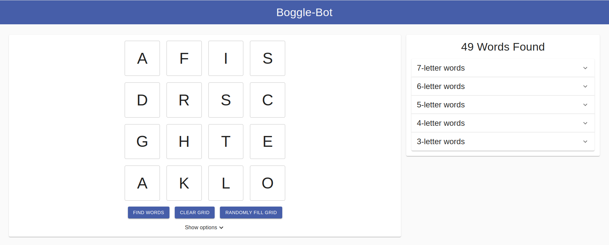
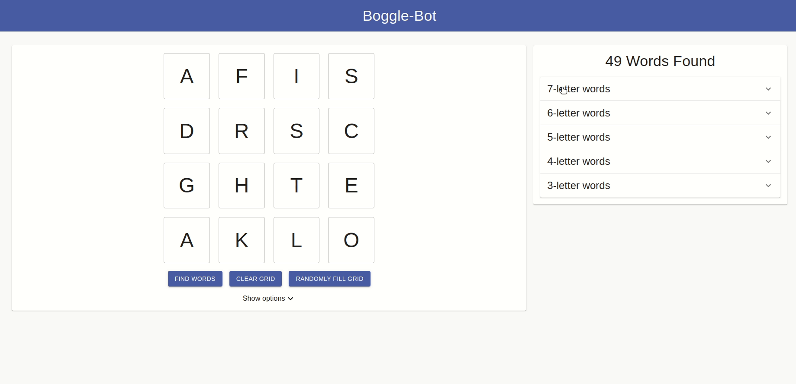
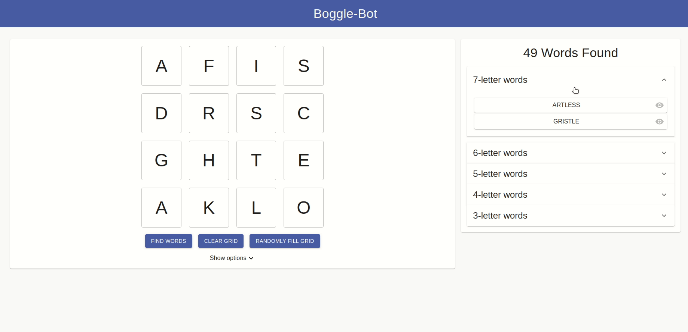

# boggle-bot

Solver for the popular word game

## Features
* Impressive performance
    * Concurrent web workers
    * Bespoke algorithm tailored to this problem
* Show path - boggle-bot can display not only the words it found, but *how* it found them!
* Full game customisation
    * Grid size: choose the size of the grid
    * Minimum word length: Filter out words shorter than a given length
    * Custom dictionary: Don't quite agree with the default dictionary? Upload your own - see [the custom dictionary section](#custom-dictionary) for details
* Word length aggregation - words found are grouped by there length in descending order and within each group ordered alphabetically
* Random grid fill
* Clear grid

### Custom Dictionary
Custom dictionaries can be uploaded. To do this, they must follow a certain format.
* Files must be **plaintext**
* Each word appears on it's **own line** as the only characters on that line
* All words in **lowercase**
    * This can be useful to automatically remove proper nouns as only lowercase words will be matched.
    * NB: for performance, it is still better to remove these
* **No whitespace** (other than each `EOL` of course)

## Screenshots

---

This project was bootstrapped with [Create React App](https://github.com/facebook/create-react-app).

## Available Scripts

In the project directory, you can run:

### `npm start`

Runs the app in the development mode. 
Open [http://localhost:3000](http://localhost:3000) to view it in the browser.

The page will reload if you make edits. 
You will also see any lint errors in the console.

### `npm test`

Launches the test runner in the interactive watch mode. 
See the section about [running tests](https://facebook.github.io/create-react-app/docs/running-tests) for more information.

### `npm run build`

Builds the app for production to the `build` folder. 
It correctly bundles React in production mode and optimizes the build for the best performance.

The build is minified and the filenames include the hashes. 
Your app is ready to be deployed!

See the section about [deployment](https://facebook.github.io/create-react-app/docs/deployment) for more information.

### `npm run deploy`

Deploy to gh-pages. N.B: you will need to update the `homepage` section in `package.json` to reflect your site's homepage before deployment.

## Learn More

You can learn more in the [Create React App documentation](https://facebook.github.io/create-react-app/docs/getting-started).

To learn React, check out the [React documentation](https://reactjs.org/).

### Code Splitting

This section has moved here: https://facebook.github.io/create-react-app/docs/code-splitting

### Analyzing the Bundle Size

This section has moved here: https://facebook.github.io/create-react-app/docs/analyzing-the-bundle-size

### Making a Progressive Web App

This section has moved here: https://facebook.github.io/create-react-app/docs/making-a-progressive-web-app

### Advanced Configuration

This section has moved here: https://facebook.github.io/create-react-app/docs/advanced-configuration

### Deployment

This section has moved here: https://facebook.github.io/create-react-app/docs/deployment

### `npm run build` fails to minify

This section has moved here: https://facebook.github.io/create-react-app/docs/troubleshooting#npm-run-build-fails-to-minify
